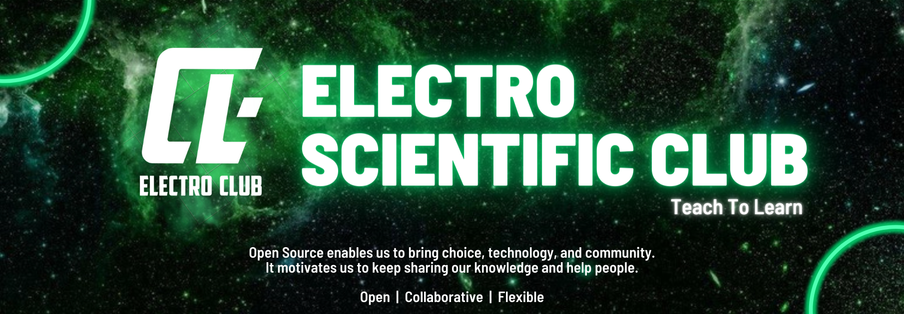

# GitHub Profile

Default community files for the Electro Scientific Club organization on GitHub.

 

## Thank _You_!
Please :star: this repo to help us improve the quality.
  

## License
The content of this project is licenced under the [MIT License](LICENSE).

----

## 🌐 Socials - Get In Touch:

 
 

